# Project Overview

EventLead AI is a full-stack web application designed to help businesses manage leads collected during events, conferences, exhibitions, networking sessions, and other business events.

Users can add, view, edit, delete, search, and filter leads, track follow-up status, view analytics, calculate lead priority scores, generate AI summaries, generate personalized follow-up messages, and create or restore backups.

---

## Live Application

**Live Demo:**  
https://eventlead-ai-xi.vercel.app/

**GitHub Repository:**  
https://github.com/OmkarrMain/event_lead-ai

# Features

## Lead Management

The application supports complete CRUD operations.

Users can create leads containing:

- Name
- Company
- Email
- Event
- Interaction notes
- Follow-up status

Existing leads can be viewed, edited, and deleted.

## Search

Backend-powered search works across:

- Name
- Company
- Email
- Event
- Interaction notes

Example:

```text
GET /api/leads/?search=Rahul
```

## Filtering

Leads can be filtered by:

- Follow-up status
- Event

Available statuses:

```text
PENDING
CONTACTED
FOLLOW_UP
CONVERTED
CLOSED
```

## Analytics

The application provides:

- Total leads
- Pending leads
- Contacted leads
- Follow-up leads
- Converted leads
- Closed leads
- Conversion rate
- Leads grouped by event

## Lead Scoring

EventLead AI includes a deterministic rule-based lead scoring system.

The score considers:

- Company availability
- Email availability
- Event information
- Interaction notes
- Follow-up status

The result is classified as:

```text
HIGH
MEDIUM
LOW
```

The API also returns reasons and a recommendation.

---

# AI Features

EventLead AI uses Gemini for two generative AI tasks:

1. Interaction note summarization
2. Personalized follow-up message generation

Generative AI is not used for basic CRUD operations or deterministic lead scoring.

## AI Interaction Summary

The application sends the lead information and interaction notes to Gemini and generates a concise professional summary.

The prompt instructs the model to use only provided information and avoid inventing facts.

### Workflow

```text
Lead Information
       |
       v
Interaction Notes
       |
       v
FastAPI Backend
       |
       v
Gemini
       |
       v
AI Generated Summary
```

## AI Follow-Up Message

The application generates a personalized follow-up message using:

- Lead name
- Company
- Event
- Follow-up status
- Interaction notes

The generated message is instructed to remain professional, mention the event naturally, use the interaction notes, include a clear next step, and avoid invented facts.

### Workflow

```text
Lead Information
       |
       v
Interaction Notes
       |
       v
FastAPI Backend
       |
       v
Gemini
       |
       v
Personalized Follow-Up Message
```

---

# Technology Stack

## Frontend

- React
- Vite
- JavaScript
- HTML
- CSS

## Backend

- Python
- FastAPI
- SQLAlchemy
- Pydantic
- Uvicorn

## Database

- PostgreSQL
- Neon PostgreSQL for production

## AI

- Google Gemini API
- google-genai

## Deployment

- GitHub
- Vercel

## Development

- Visual Studio Code
- Python Virtual Environment
- Docker
- PostgreSQL

---

# System Architecture

```text
                         EVENTLEAD AI
                              |
               +--------------+--------------+
               |                             |
               v                             v
        React + Vite                    FastAPI
         Frontend                      Backend API
               |                             |
               +---------- /api -------------+
                              |
                              v
                       SQLAlchemy ORM
                              |
                              v
                       PostgreSQL
                         / Neon
                              |
                     +--------+--------+
                     |                 |
                     v                 v
              Lead Analytics      Gemini AI
                     |                 |
                     |          +------+------+
                     |          |             |
                     |          v             v
                     |      AI Summary   AI Follow-Up
                     |
                     v
                 Dashboard
```

---

# Project Structure

```text
event_lead-ai/
│
├── backend/
│   ├── app/
│   │   ├── models/
│   │   │   └── lead.py
│   │   ├── schemas/
│   │   │   └── lead.py
│   │   ├── routes/
│   │   │   ├── leads.py
│   │   │   └── analytics.py
│   │   ├── services/
│   │   │   ├── ai_service.py
│   │   │   ├── analytics.py
│   │   │   ├── follow_up.py
│   │   │   ├── lead_scoring.py
│   │   │   └── lead_summary.py
│   │   ├── database.py
│   │   └── main.py
│   ├── requirements.txt
│   └── .env
│
├── frontend/
│   ├── src/
│   │   ├── services/
│   │   │   ├── api.js
│   │   │   └── backup.js
│   │   └── ...
│   ├── package.json
│   └── .env
│
├── docs/
│   └── screenshots/
│
├── vercel.json
├── .gitignore
└── README.md
```

---

# Database Design

The primary database entity is the `Lead`.

| Field              | Description                    |
| ------------------ | ------------------------------ |
| `id`               | Unique lead identifier         |
| `name`             | Lead name                      |
| `company`          | Company name                   |
| `email`            | Contact email                  |
| `event`            | Event associated with the lead |
| `notes`            | Interaction notes              |
| `follow_up_status` | Current follow-up status       |
| `created_at`       | Lead creation timestamp        |

SQLAlchemy is used as the ORM layer between FastAPI and PostgreSQL.

---

# API Endpoints

## Lead APIs

| Method | Endpoint               | Purpose        |
| ------ | ---------------------- | -------------- |
| POST   | `/api/leads/`          | Create a lead  |
| GET    | `/api/leads/`          | Get all leads  |
| GET    | `/api/leads/{lead_id}` | Get one lead   |
| PUT    | `/api/leads/{lead_id}` | Update a lead  |
| DELETE | `/api/leads/{lead_id}` | Delete a lead  |
| POST   | `/api/leads/restore`   | Restore backup |

## Search and Filtering

```text
GET /api/leads/?search=rahul
GET /api/leads/?status=FOLLOW_UP
GET /api/leads/?event=Tech Expo
```

## AI APIs

| Method | Endpoint                         | Purpose               |
| ------ | -------------------------------- | --------------------- |
| GET    | `/api/leads/{lead_id}/score`     | Calculate lead score  |
| GET    | `/api/leads/{lead_id}/summary`   | Generate AI summary   |
| GET    | `/api/leads/{lead_id}/follow-up` | Generate AI follow-up |

## Analytics

```text
GET /api/analytics/
```

---

# API Documentation

FastAPI automatically provides interactive Swagger API documentation.

## Local

```text
http://127.0.0.1:8000/docs
```

## Production

https://eventlead-qfaipl3su-fuzi-kaje.vercel.app/api/docs

---

# Backup and Restore

EventLead AI provides manual and automatic backup functionality.

## Manual Backup

Lead data can be exported as a JSON file.

Example:

```json
{
  "app": "EventLead AI",
  "version": 1,
  "created_at": "2026-01-01T10:00:00.000Z",
  "leads": []
}
```

## Restore

A previously exported JSON backup can be selected and restored through the application.

The backend validates the backup application identifier before restoring data.

Existing leads are updated and new leads are created when required.

## Automatic Backup

Automatic backups are stored in browser local storage while the application is running.

The automatic backup mechanism creates a backup when enabled, updates it periodically, and stores the latest backup timestamp.

Manual backup remains available for creating a downloadable JSON file.

---

# Environment Variables

Sensitive information is stored using environment variables.

## Backend

Create:

```text
backend/.env
```

Example:

```env
DATABASE_URL=your_neon_postgresql_connection_string
GEMINI_API_KEY=your_gemini_api_key
FRONTEND_URL=http://localhost:5173
```

## Frontend

Create:

```text
frontend/.env
```

Local development:

```env
VITE_API_URL=http://127.0.0.1:8000/api
```

Production:

```env
VITE_API_URL=/api
```

Production environment variables are configured directly in Vercel.

---

# Local Development Setup

## Clone Repository

```bash
git clone https://github.com/OmkarrMain/event_lead-ai.git
cd event_lead-ai
```

## Backend

```bash
cd backend
python -m venv venv
```

Windows:

```powershell
venv\Scriptsctivate
```

Install dependencies:

```bash
pip install -r requirements.txt
```

Create `backend/.env`:

```env
DATABASE_URL=your_database_url
GEMINI_API_KEY=your_gemini_api_key
FRONTEND_URL=http://localhost:5173
```

## Run Backend

```bash
uvicorn app.main:app --reload
```

Backend:

```text
http://127.0.0.1:8000
```

Swagger:

```text
http://127.0.0.1:8000/docs
```

## Frontend

Open another terminal:

```bash
cd frontend
npm install
```

Create `frontend/.env`:

```env
VITE_API_URL=http://127.0.0.1:8000/api
```

Run:

```bash
npm run dev
```

Frontend:

```text
http://localhost:5173
```

---

# Production Deployment

The application is deployed using GitHub and Vercel.

Vercel Services deploys both applications from the same repository:

```text
frontend/
    React + Vite

backend/
    FastAPI
```

Production routing:

```text
/       → React frontend
/api/*  → FastAPI backend
```

Backend entrypoint:

```text
app.main:app
```

---

# Production Architecture

```text
                    User Browser
                         |
                         v
                       Vercel
                         |
              +----------+----------+
              |                     |
              v                     v
       React + Vite             FastAPI
        Frontend                Backend
                                    |
                                    v
                            Neon PostgreSQL
                                    |
                                    v
                               Gemini AI
```

---

# Screenshots

Store screenshots inside:

```text
docs/screenshots/
```

Recommended filenames:

```text
docs/
└── screenshots/
    ├── dashboard.png
    ├── lead-management.png
    ├── add-edit-lead.png
    ├── search-filter.png
    ├── analytics.png
    ├── ai-score.png
    ├── ai-summary.png
    ├── ai-follow-up.png
    ├── backup-restore.png
    └── swagger.png
```

## Dashboard

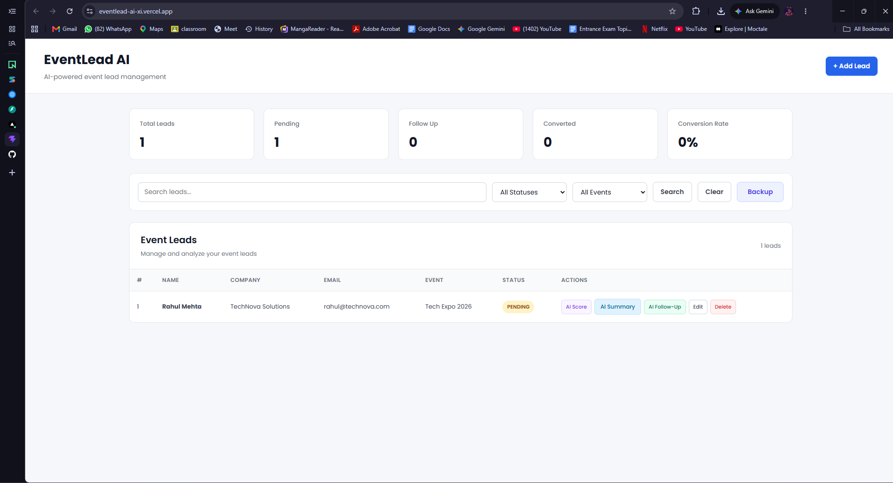

## Lead Management

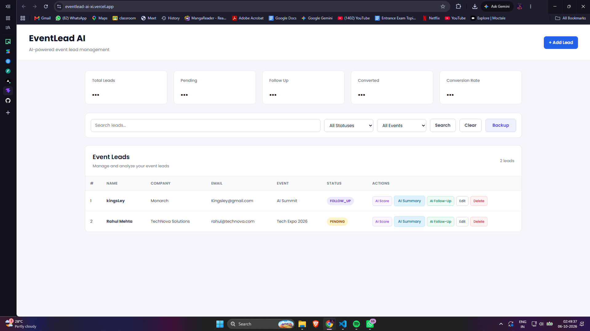

## Add / Edit Lead

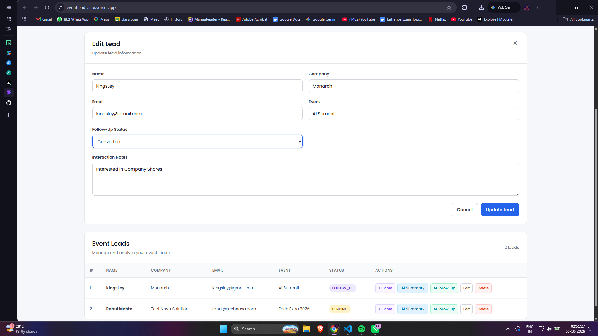

## Search and Filtering

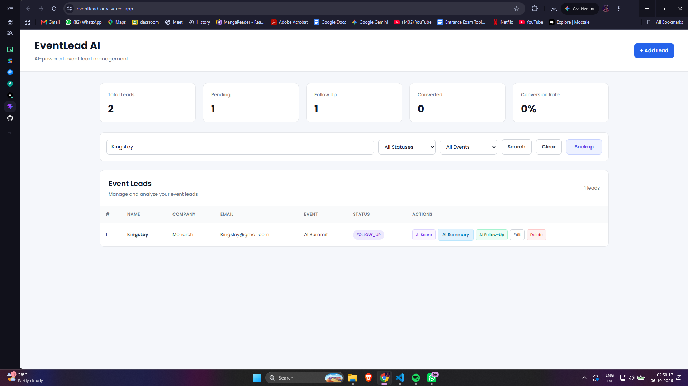

## Analytics

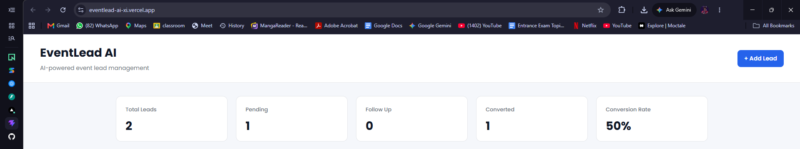

## AI Lead Score

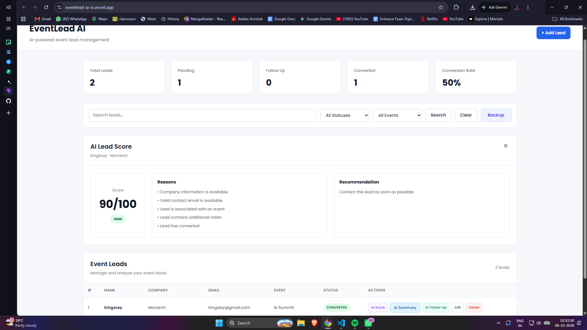

## AI Summary

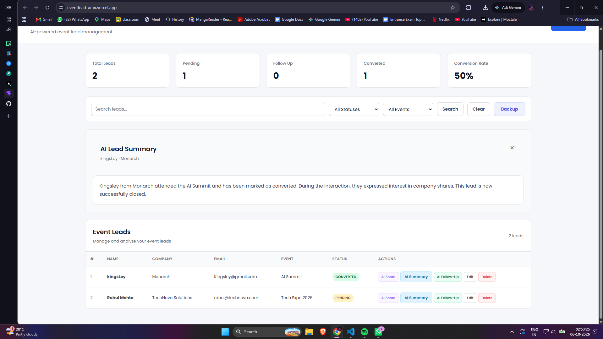

## AI Follow-Up

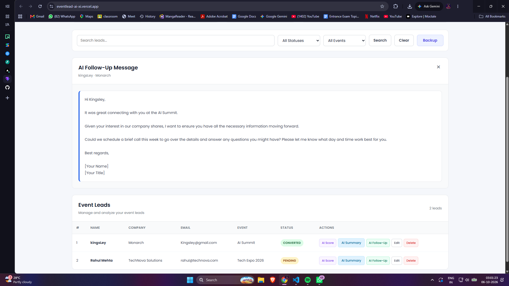

## Backup and Restore

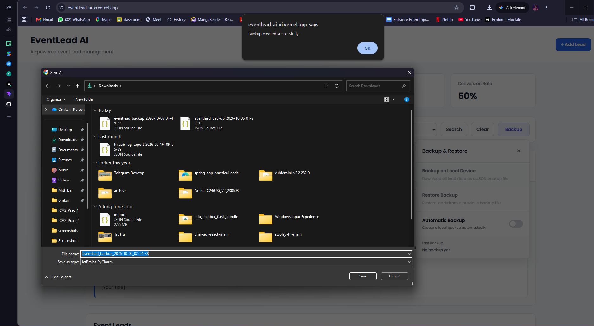

## Swagger API Documentation

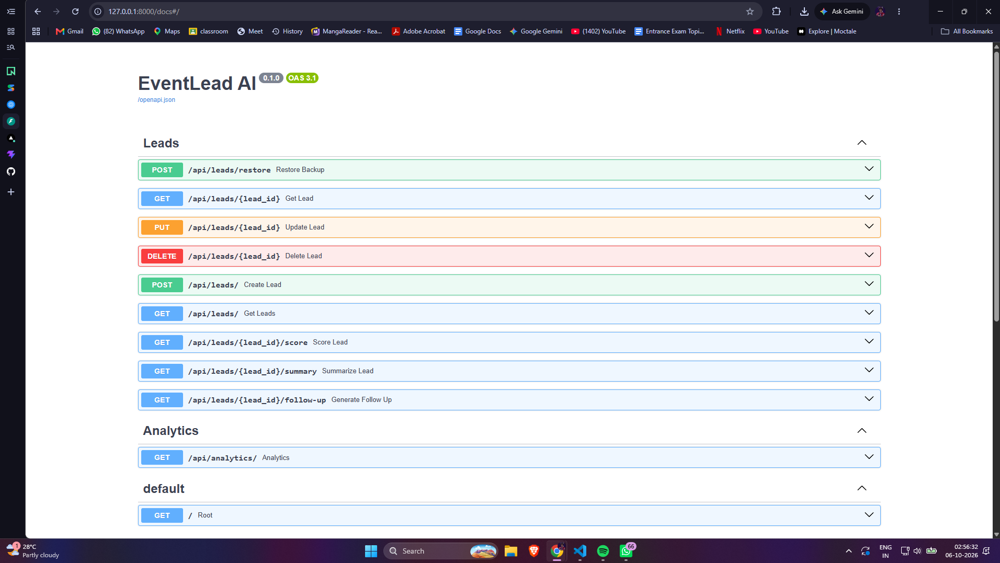

## Neon DB

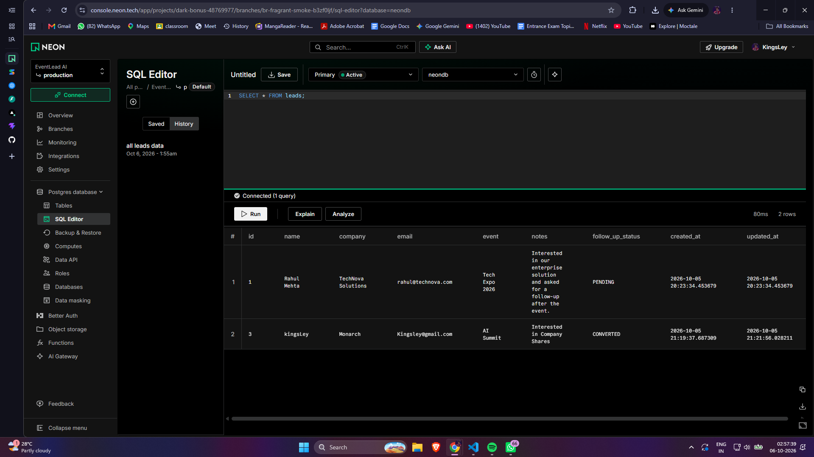

---

# Technical Decisions

## React + Vite

React was selected for the frontend because it provides a component-based architecture suitable for building an interactive lead management interface.

Vite was used as the build tool because it provides a fast development environment and production build process.

## FastAPI

FastAPI was selected for the backend because it provides:

- REST API development
- Automatic API documentation
- Pydantic-based validation
- Dependency injection
- Clean route organization
- Python integration

## PostgreSQL

PostgreSQL was selected because the application contains structured relational data such as leads, statuses, events, and timestamps.

Neon PostgreSQL is used as the production database.

## SQLAlchemy

SQLAlchemy is used as the ORM layer between the Python backend and PostgreSQL.

## Gemini

Gemini is used for:

1. Interaction note summarization
2. Personalized follow-up message generation

Basic CRUD operations and deterministic lead scoring do not require generative AI.

## Vercel

Vercel is used for production deployment of the React frontend and FastAPI backend.

The `/api` path routes requests to the backend.

---

# Security and Configuration

Sensitive credentials are not stored in the GitHub repository.

Environment variables are used for:

```text
DATABASE_URL
GEMINI_API_KEY
```

`.env` files are excluded using `.gitignore`.

API keys should never be hard-coded into source code or committed to GitHub.

Production environment variables are configured through Vercel.

---

# Current Limitations

- No user authentication system
- No role-based access control
- No email delivery service
- Automatic browser backup depends on the application remaining open
- Lead scoring is rule-based rather than machine-learning based
- AI functionality depends on Gemini availability
- AI service usage is subject to external API limits

---

# Future Improvements

Possible future improvements include:

- User authentication
- Role-based access control
- Team-based lead management
- Email integration
- Automated follow-up scheduling
- Calendar integration
- Advanced machine-learning-based lead scoring
- Lead conversion prediction
- AI-generated event insights
- Notification system
- CSV import and export
- Advanced analytics and charts
- Audit logging
- Pagination for large datasets

---

# Assignment Requirements

EventLead AI was developed to satisfy the core requirements of the AI Event Lead Manager assignment.

## Lead Management

Implemented:

- Add leads
- Edit leads
- Delete leads
- Search leads
- Filter leads

## Lead Information

The system stores:

- Name
- Company
- Email
- Event
- Notes
- Follow-up status

## Database

Lead information is stored in PostgreSQL.

Production data is stored using Neon PostgreSQL.

## AI Integration

The application uses generative AI for:

- Interaction note summarization
- Follow-up message generation

## User Interface

The application provides a responsive interface for managing event leads and interacting with AI-assisted functionality.

## Deployment

The application is deployed publicly using Vercel.

---

# Key API Flow

## Lead Creation

```text
User
 |
 | Create Lead
 v
React Frontend
 |
 | POST /api/leads/
 v
FastAPI
 |
 | SQLAlchemy
 v
PostgreSQL
 |
 v
Lead Stored
```

## AI Summary

```text
User
 |
 | Request Summary
 v
React Frontend
 |
 | GET /api/leads/{id}/summary
 v
FastAPI
 |
 | Lead Notes
 v
Gemini
 |
 v
AI Summary
 |
 v
React Frontend
```

## AI Follow-Up

```text
User
 |
 | Generate Follow-Up
 v
React Frontend
 |
 | GET /api/leads/{id}/follow-up
 v
FastAPI
 |
 | Lead + Notes
 v
Gemini
 |
 v
Personalized Follow-Up Message
 |
 v
React Frontend
```

---

# Git Workflow

The project uses Git and GitHub for version control.

Typical workflow:

```bash
git add .
git commit -m "Update application"
git push origin main
```

Vercel is connected to the GitHub repository so changes pushed to the main branch can trigger new deployments.

---
